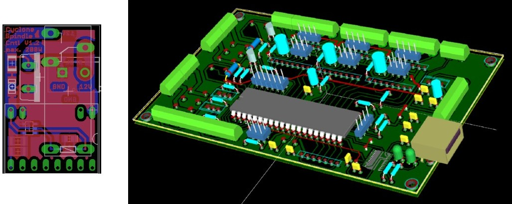
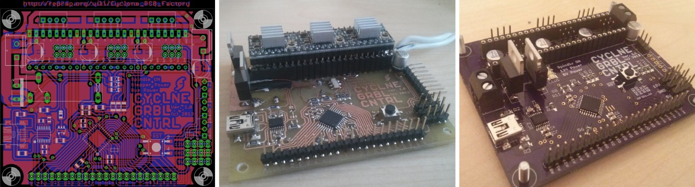
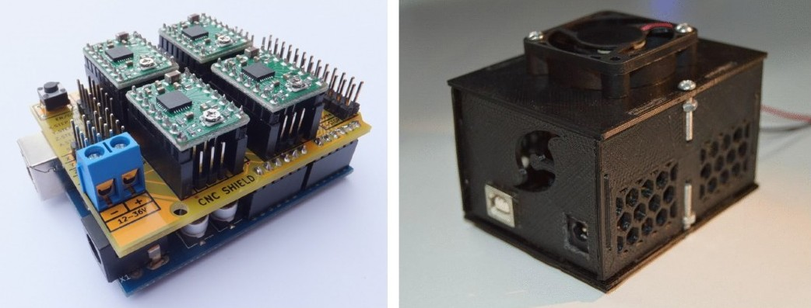

Electronics for Cyclone-PCB-Factory  
===================

Electronic boards (and firmwares) for controlling Cyclone PCB Factory and similar machines  

* [Spindle controller by Samuel Kranz](https://github.com/secures92/SpindleControlStick) and [Controller board by Robert Last](https://github.com/robsbots/Cyclone_Pcb):

* [GRBL-based controller board by Samuel Kranz](https://github.com/secures92/CyclneGRBLCtrl):

* [CNC Shield by Protoneer](http://blog.protoneer.co.nz/arduino-cnc-shield/) and [CNC Shield box by yOPERO](../Hardware/yOPERO/CNC_shieldBox):

Disclaimer  
--
This hardware/software is provided "as is", and you use the hardware/software at your own risk. Under nocircumstances shall any author be liable for direct, indirect, special, incidental, or consequential damages resulting from the use, misuse, or inability to use this hardware/software, even if the authors have been advised of the possibility of such damages.  

