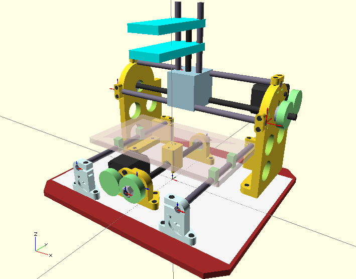
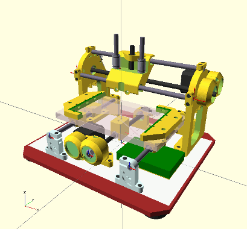

Hardware for Cyclone-PCB-Factory  
===================

Version 2.0a  
--  
Adressing all the issues from the original design, implementing improvements by yOPERO, Martin Zabojnik and others.

* More robust design with tougher parts:
 * Better holders for the linear bearings (vibration makes them slide away)
 * Reinforced nut/screw holders
* Attachment for a vacuum cleaner
* Better scalability (parameterized design)
* Using a [Dremel 200](http://www.dremel.com/en-us/tools/Pages/ToolDetail.aspx?pid=200+Series) as the spindle motor
* Integrated endstop holders

Work in progress. Pending tasks:  
--  
* Improve vacuum cleaner attachment (make it detachable)
* Create protective covers for the gears
* Endstop integration for X, Y and Z
* Better plastic-saving holes for the X frames
* Improve the nut holder in the X carriage (with the same spring mechanism as in Y)
* Re-design the [Z carriage](INHERITED) after testing performance
* Re-design the [gears](INHERITED) with smoother edges

  

The new design tries to be more parameterized:

  

Disclaimer  
--
This hardware/software is provided "as is", and you use the hardware/software at your own risk. Under nocircumstances shall any author be liable for direct, indirect, special, incidental, or consequential damages resulting from the use, misuse, or inability to use this hardware/software, even if the authors have been advised of the possibility of such damages.  

