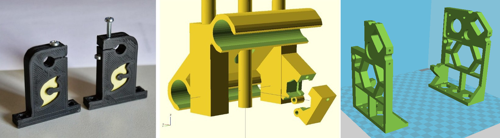
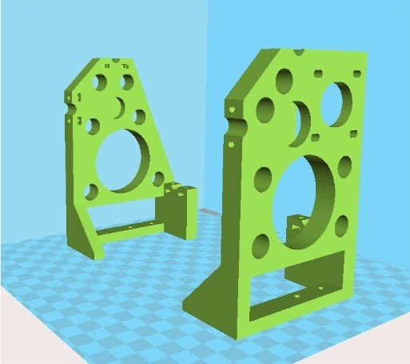
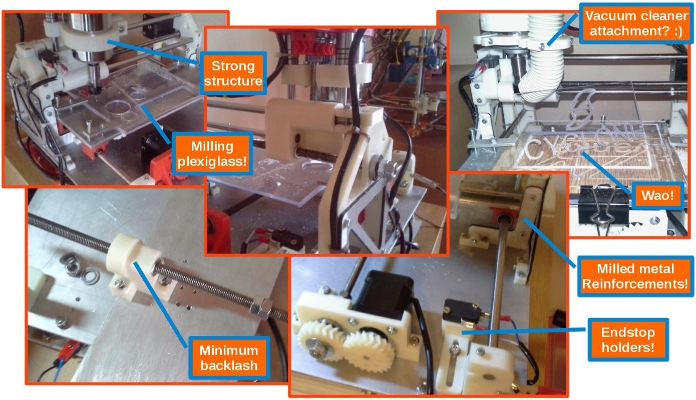
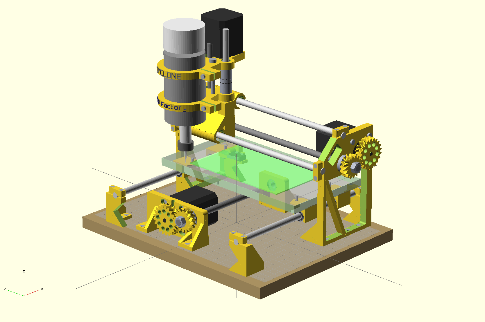
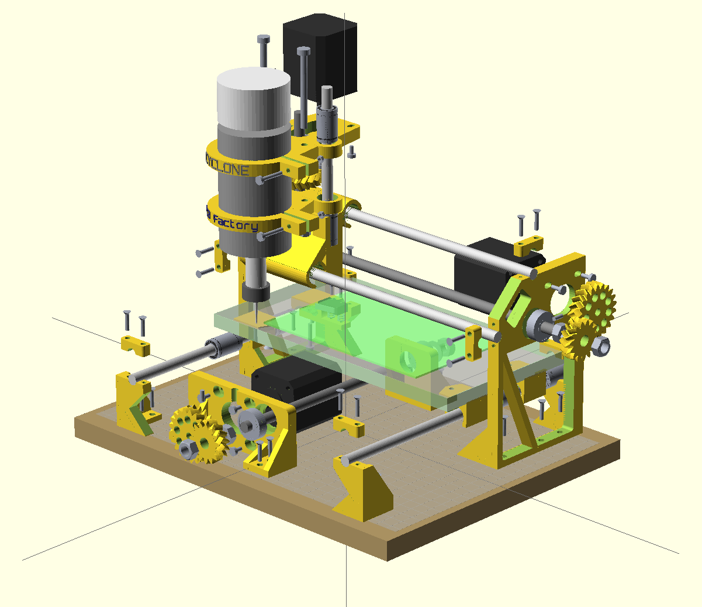

Hardware for Cyclone-PCB-Factory  
===================

To-Do list  
--  
There are plenty of work fronts open, as many task are pending:

* Tougher parts (great ongoing work!):
 * Stronger holders for the linear bearings (vibration makes them slide away)
 * Reinforce screw holders
* Attachment for a vacuum cleaner
* Better scalability (particularly for the Y axis)
* Better spindle motor design:
 * Brushless motor for the spindle
 * Spindle speed control
* Integrated endstop holders

News  
-- 
* Check out [yOPERO's variant of Cyclone](yOPERO/):

* Check out these [sturdy frames by Jiří Pilný](https://groups.google.com/forum/#!msg/cyclone-pcb-factory/uVLyKMvz4hA/HmpsZP1CiLUJ):

* Check out [Martin's variant of Cyclone](http://www.thingiverse.com/thing:230233):

Render (v0.9.7)  
--
  
  
**Thanks a lot to Glen Chung for the fully assembled renders**  

Notes  
--  
- Using a thick wood piece as the main base.  
- As shown in one of the pictures, a cheap dremel-like drill has nice bearings and is a good option as the main tool. **Finally it will be using a proper spindle** (check the BOM for the reference).  
- Desired working range of >=100mm for the X axis and >=160mm for the Y axis.  
- Parts are designed to be printable with the small volume of a Printrbot Jr  
- Bed leveling is done with probing and an appropriate software.  

License  
--
License: **Attribution - Share Alike - Creative Commons (<http://creativecommons.org/licenses/by-sa/3.0/>)**  

Authors (Hardware):  
--
- **Carlos García Saura (Carlosgs <http://carlosgs.es>)** (original design)  
- **Daniel Garrido (yOPERO <https://github.com/yOPERO> & <http://yopero-tech.blogspot.com.es/>)** (hardware improvements)  
- **Harry Binnema** (hardware improvements)
- **Glen Chung (<https://github.com/glenchung>)** (Full assembly in OpenScad)
- **Jiří Pilný** (hardware improvements)
- **Martin Zabojnik** (hardware improvements)

Special thanks  
--  
- Z axis concepts by **Quim Borras** and the spindle motor holder by **Misan** were really useful!! Also, **Diego Viejo**'s machine was of great inspiration for the Z axis (<https://plus.google.com/u/0/photos/113930344830086538817/albums/5868944432651911713?authkey=CLDJgdehlN773gE>) **Thank you all!!**  
- This design woudn't have been possible without the encouragement of the **Panda CNC community** (<https://plus.google.com/u/0/communities/102402711800402614517>)  
- Also, thanks to **Juan González-Gómez (Obijuan <http://iearobotics.com>)** for naming the machine Cyclone :)  

Derived from / we have used / inspirational  
--
- "Linear actuator concept for CNC machines" by **Carlosgs** (<http://www.thingiverse.com/thing:45103>)  
- "Obiscad library" by **Obijuan** (<https://github.com/Obijuan/obiscad>)  
- "Minimal footprint friction-fit LM8UU holder" by **thantik** (<http://www.thingiverse.com/thing:23041>)  
- "Spindle mount for ShapeOko" by **Misan** (<http://www.thingiverse.com/thing:26740>)  
- "Carro Z para Cyclone CNC mill intended for PCB" by **Quim** (<http://www.thingiverse.com/thing:80718>)  
- "Write.scad (and DXF fonts)" by **HarlanDMii** (<http://www.thingiverse.com/thing:16193>)  
- "PCB Machining Vise" by **Forgetful_Guy** (<http://www.thingiverse.com/thing:63578>)  

Credit for the ideas used  
--  
The origin of Cyclone took place while I was inside the **Panda CNC** community (<https://plus.google.com/u/0/communities/102402711800402614517>). This is from December 2012 to mid-February 2013.  
Here is the credit for the ideas that were used:  

* _Let's design a 3D-printable CNC for PCB milling, it will be named Panda:_ **Guillermo Welch** (mid-December, via Google Talk)  
* _X carriage rod distribution:_ **César Augusto Fernández Cano** claims Cyclone's X axis is a derivate of his concept: <https://plus.google.com/u/0/111421387442355054591/posts/QrfYtEuZBaj>  
* _100x160mm workspace:_ **David Martin** <https://dl.dropboxusercontent.com/u/16122275/PandaCNC_credit/workplace_size.png>  
* _Using gears to drive the X-Y axes:_ **Guillermo Welch** <https://plus.google.com/u/0/101232926728463427403/posts/QjZGNcWcgGg>  
* _Regarding the woodbase:_ **Guillermo Welch** always contemplated the possibility of attaching the machine (optionally) to a woodbase. I decided to use the base as a main structural part instead. See <https://dl.dropboxusercontent.com/u/16122275/PandaCNC_credit/woodbase.png> (screenshot from <https://plus.google.com/u/0/113437723819360223498/posts/8LDCSSVWqCS>)  
* _List of CNC endmill types:_ **David Martin** <https://dl.dropboxusercontent.com/u/16122275/PandaCNC_credit/cnc_endmill_types.png>  

Please note I have taken screenshots of the post that are on the closed G+ Panda community (<https://plus.google.com/u/0/communities/116318709564872967169>). You can register and see by yourself.  

**All other development present on Cyclone has nothing to do with Panda and is not related to the Panda project.**  

Disclaimer  
--
This hardware/software is provided "as is", and you use the hardware/software at your own risk. Under nocircumstances shall any author be liable for direct, indirect, special, incidental, or consequential damages resulting from the use, misuse, or inability to use this hardware/software, even if the authors have been advised of the possibility of such damages.  

