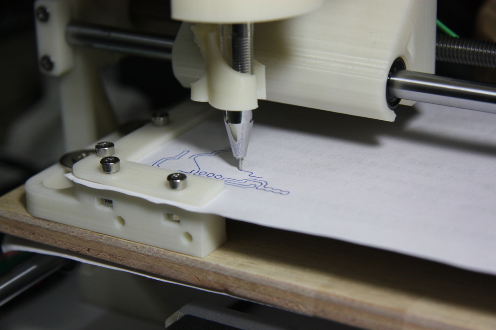

Spindle Pen
===============
**Please note: This page was [automatically generated](https://github.com/carlosgs/export-things) and may have been updated since then. Make sure to check for the current license and authorship.**  

Spindle Pen  by glenchung , published Jan 18, 2014

Description
--------
A fake spindle that holds a pen. I designed this for Cyclone Factory PCB (http://www.thingiverse.com/thing:49484) I built. I thought it might be useful to draw pcb board first before milling. Might be useful for checking XY gear ratio as well.   
 
Video of Z Probe and Milling: <a href="http://youtu.be/mdT-6VdgRn0" target="_blank" rel="nofollow">youtu.be/mdT-6VdgRn0</a>

Instructions
--------
No supports.   
15% infill   
0.2mm layer height.

Files
--------

 [ SpindlePen.stl](SpindlePen.stl)  

 [ SpindlePen.scad](SpindlePen.scad)  

Pictures
--------

Tags
--------
Cyclone_Factory_PCB , Spindle  

  

License
--------
Spindle Pen by glenchung is licensed under the Creative Commons - Attribution - Share Alike license.  

