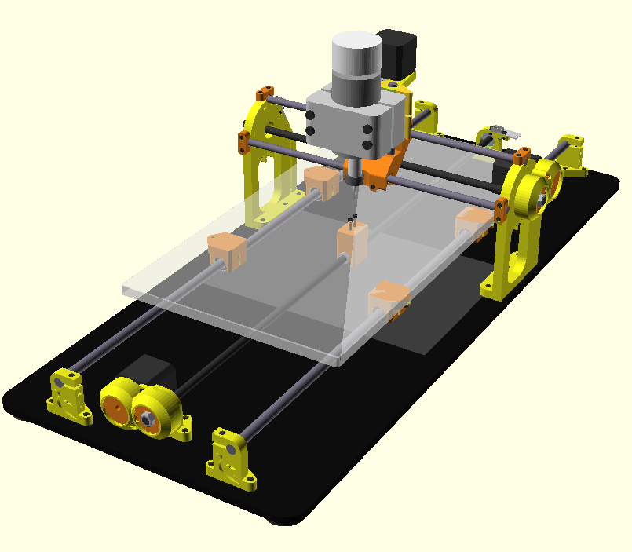

Cyclone XL (beta)
===========================

<i>Cyclone XL</i>

**Warning: This machine is experimental and may be too wobbly due to the large dimensions involved. Build at your own risk.**

Differences from regular version:  
- Smooth rod lengths: X=340mm Y=770mm (cut them with some additional margin).  
- Note that the Y rods (the long ones) must be M10 rather than M8, and the Y linear bearings LM10UU.  
- Milling area: ~50x25cm  

For the assembly, print templates [A](templates/Cyclone_base_template_A4.pdf) and [B](templates/Cyclone_workbed_template.pdf) to 1:1 scale in A4 paper. This will help you to accurately position the 3D printed parts into the wood bases. Check the [full template](templates/Cyclone_base_template.pdf) for better reference.  

Disclaimer  
--
This hardware/software is provided "as is", and you use the hardware/software at your own risk. Under no circumstances shall any author be liable for direct, indirect, special, incidental, or consequential damages resulting from the use, misuse, or inability to use this hardware/software, even if the authors have been advised of the possibility of such damages.  

