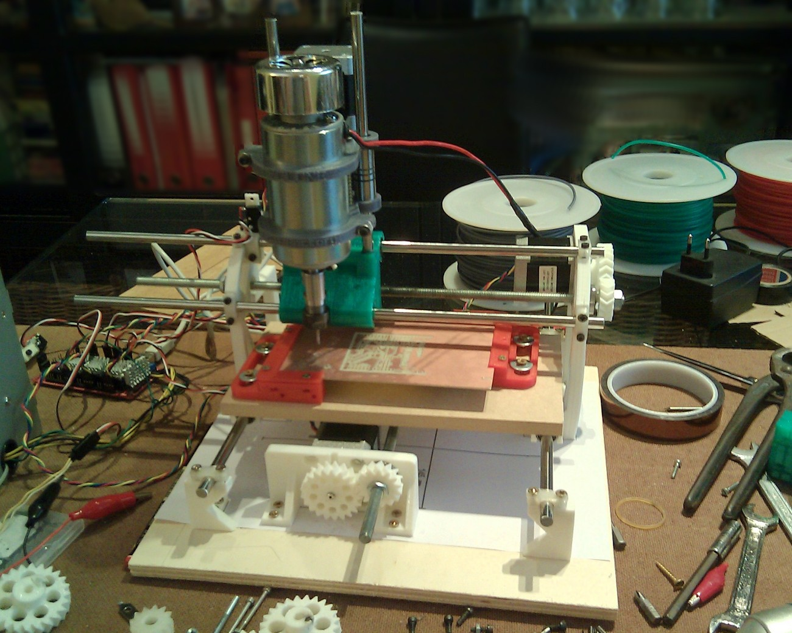

  

The first 3D-printable (Rep-Rap alike) CNC machine, intended for PCB manufacture.  

Read this, it's important!
===========================
**Upcoming [release 2.0](Hardware/CYCLONE_2)**  
If you are reading this, then you are looking at the development version of Cyclone PCB Factory. If you just want to build the machine, take a look at the following locations:  

- **Documentation: <http://reprap.org/wiki/Cyclone_PCB_Factory>**
- **Releases: <https://github.com/carlosgs/Cyclone-PCB-Factory/releases>**

<i>Cyclone v0.9.7</i>

Mail list / Forum  
-------------------
If you are interested in this project, please consider joining our mail list:  
**<https://groups.google.com/forum/#!forum/cyclone-pcb-factory>**  
Any help and feedback will be appreciated, particularly with software usage and software development :)  

Links of interest  
====================
- **[Repository of v0.9.7 (deprecated)](https://github.com/carlosgs/Cyclone-PCB-Factory/tree/v0.9.7)**
- **[Project network](https://github.com/carlosgs/Cyclone-PCB-Factory/network)** (useful to find the latest work by collaborators)
- **[Wiki entry on RepRap.org](http://reprap.org/wiki/Cyclone_PCB_Factory)**
- **[A year of development (01/20/2014)](http://carlosgs.es/node/47)** (with information regarding the evolution of the project)

Getting the (development) source files  
========================================
Install git (http://git-scm.com/) onto your system. Then run a clone:

	git clone git://github.com/carlosgs/Cyclone-PCB-Factory.git

This will download the latest sources into a directory named 'Cyclone-PCB-Factory'. 

Important step:
----------------

To pull the MCAD (<http://reprap.org/wiki/MCAD>) and Obiscad (<https://github.com/Obijuan/obiscad>) libraries, do the following:

	cd Cyclone-PCB-Factory
	git submodule update --init

Bill of materials (to be updated and moved to the RepRap wiki page)  
--  
Kobus' <https://docs.google.com/spreadsheet/ccc?key=0AjYcEd1WlkqCdERINEFvRk9mVTZvdXZFR0VHVjRWc2c#gid=0>  
Robsbots' <https://docs.google.com/spreadsheet/ccc?key=0AmiiQRLnjs9cdE12VDFmTHJ4N3JoTzcwbkJPb0ZLSWc#gid=0>  
Carlosgs' <https://docs.google.com/spreadsheet/ccc?key=0AsQp8IK25R4IdGk3LTdOWmpFR0Nrc0RhaVJaUC1CMUE>  

Videos  
--  
- v2.0a Milling wax (August 2014): <https://www.youtube.com/watch?v=drV_r_OSsi4>
- v0.9.7 Cyclone PCB factory, the process (June 2013): <http://www.youtube.com/watch?v=fKW3fwy1h0k>
- v0.9.6 Y axis concept by Yopero <http://www.youtube.com/watch?v=XzcobonQP40>  
- v0.9.5 Probing a PCB <http://www.youtube.com/watch?v=m5zXL8k5T9E>  
- v0.9.5 Milling MDF <http://www.youtube.com/watch?v=2QpxjheEjEc> and <http://www.youtube.com/watch?v=zjav0hBtmYA>  
- v0.8 Drawing test: <http://www.youtube.com/watch?v=Y-HSdE89JOM>  
- v0.7.5 XY axis test: <http://www.youtube.com/watch?v=9umlq4oHG64>  
- v0.7.5 High speed XY test: <http://www.youtube.com/watch?v=H3uYCXryj60>  

License  
--
**Attribution - Share Alike - Creative Commons (<http://creativecommons.org/licenses/by-sa/4.0/>)**  

Authors  
--
_Check Hardware, Software and Firmware sections for details regarding authorship_  

Render (v0.9.7)  
--
  
  
**Thanks a lot to Glen Chung for the fully assembled renders**  

Disclaimer  
--
This hardware/software is provided "as is", and you use the hardware/software at your own risk. Under no circumstances shall any author be liable for direct, indirect, special, incidental, or consequential damages resulting from the use, misuse, or inability to use this hardware/software, even if the authors have been advised of the possibility of such damages.  

