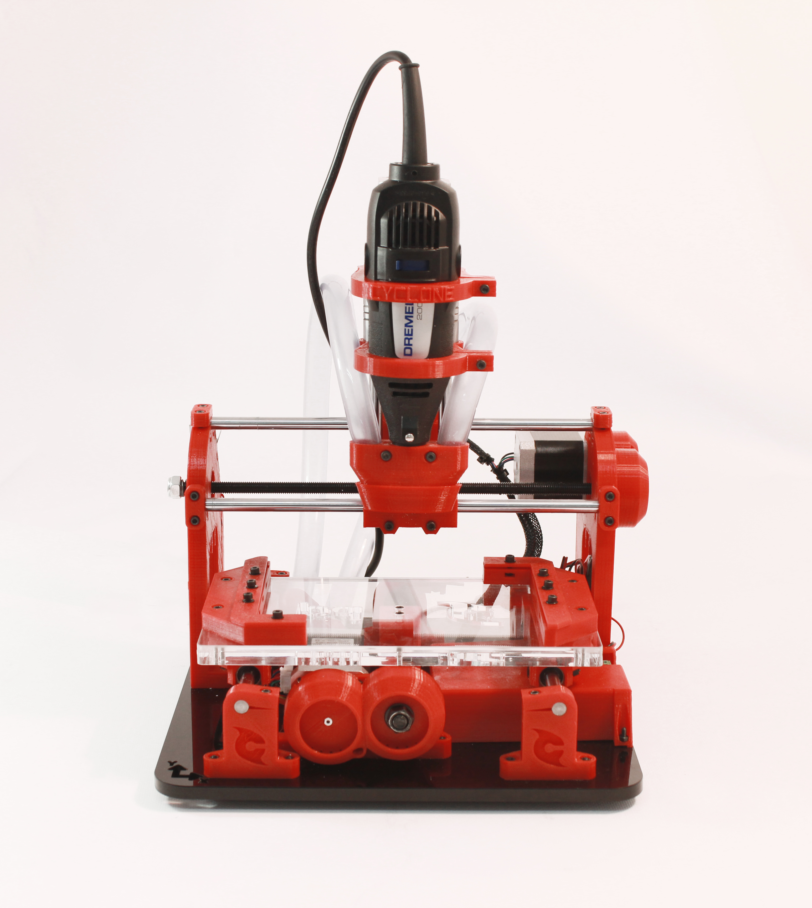
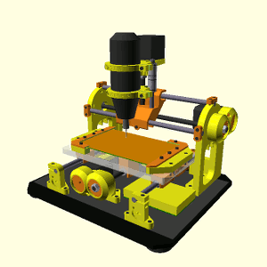
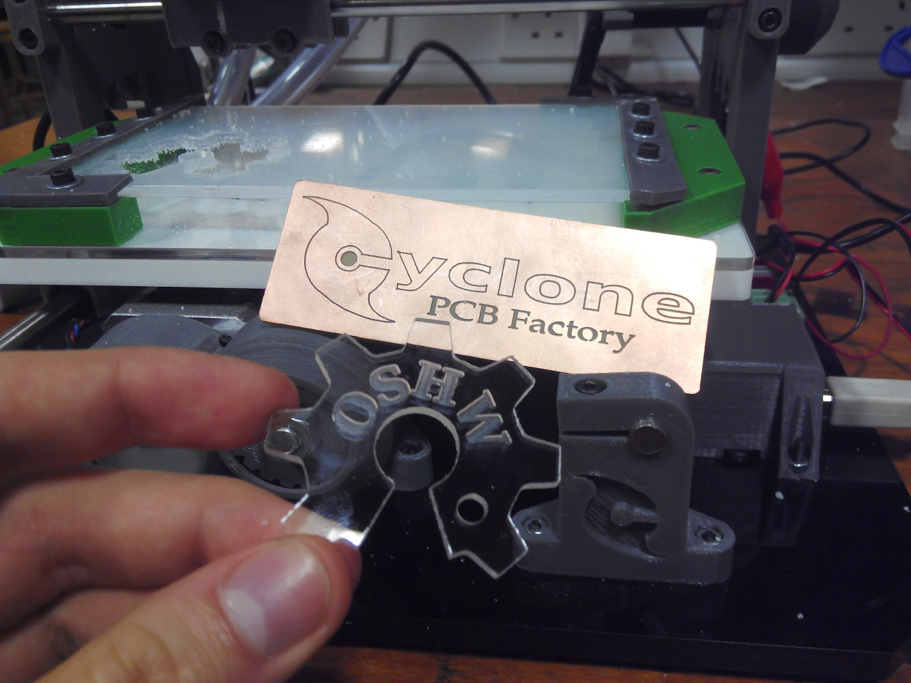
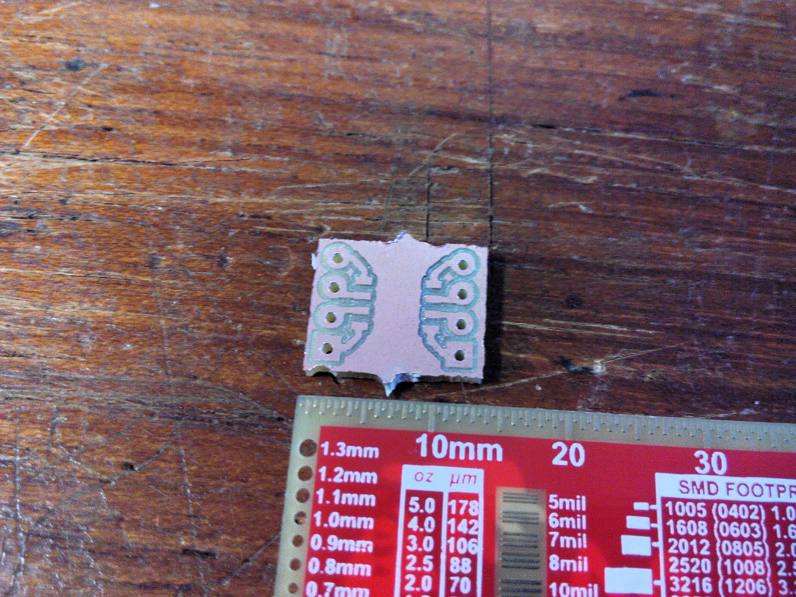
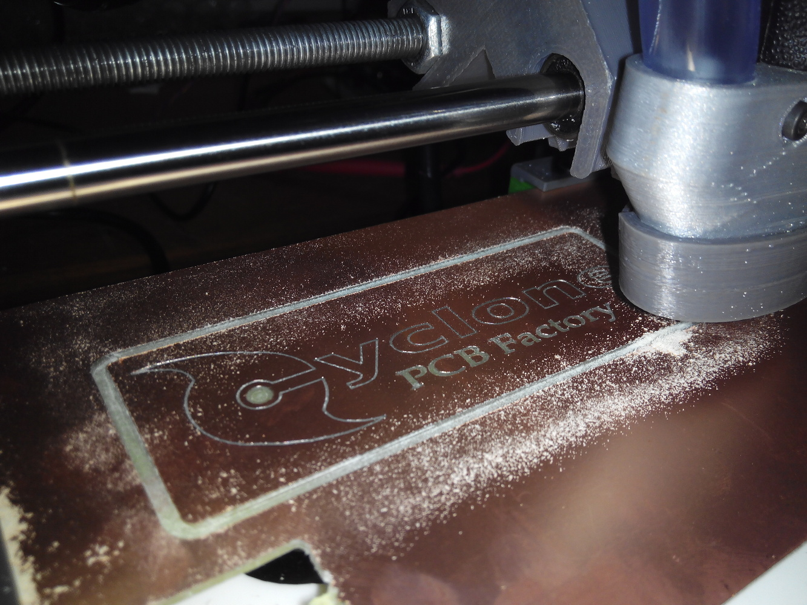
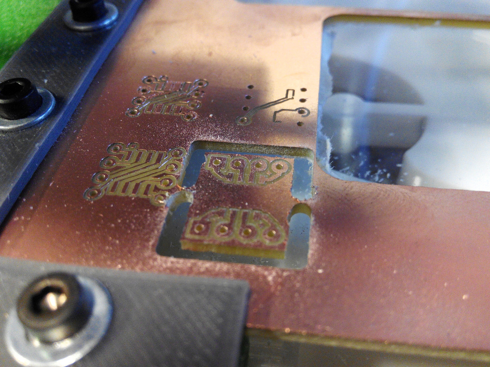

[](https://doi.org/10.5281/zenodo.10442930)
<p align="center">

<div align="center"><i>A 3D-printable (Rep-Rap alike) CNC machine, intended for PCB manufacture.</i></div>
</p>  

Read this, it's important!
-----------

Please note that this project is no longer active and is of historical interest only.
===========

Check out this thread before printing the parts: <https://github.com/CarlosGS/Cyclone-PCB-Factory/issues/57>

**Also take a look at the following locations:**

- **Releases: <https://github.com/carlosgs/Cyclone-PCB-Factory/releases>**
- **Documentation: <https://github.com/carlosgs/Cyclone-PCB-Factory/wiki>**

<p align="center">

<div align="center"><i>Cyclone v2. Picture by bq</i></div>
</p>


Mail list / Forum  
-------------------
If you are interested in this project, please consider joining our mail list:  
**English: <https://groups.google.com/forum/#!forum/cyclone-pcb-factory>**  
**Spanish/Español: <https://groups.google.com/forum/#!forum/cyclone-pcb-factory-es>**  


Links of interest  
====================
- **[GitHub project network](https://github.com/carlosgs/Cyclone-PCB-Factory/network)** (useful to find the latest work by collaborators)
- **[Wiki entry on RepRap.org](http://reprap.org/wiki/Cyclone_PCB_Factory)**
- **[Joco's Cyclone journey in the mail list](https://groups.google.com/forum/#!topic/cyclone-pcb-factory/o_YzXokpLnA)**
- **[A year of development (Jan/2014)](https://web.archive.org/web/20150627040708/http://carlosgs.es/node/47)** (project evolution during 2013)
- **[List of suppliers](https://github.com/carlosgs/Cyclone-PCB-Factory/wiki/List-of-suppliers)**

Getting the (development) source files  
========================================
Install git (http://git-scm.com/) onto your system. Then run a clone:


	git clone git://github.com/carlosgs/Cyclone-PCB-Factory.git


This will download the latest sources into a directory named 'Cyclone-PCB-Factory'.  


Current stable version: 2.1  
--  

**Recent news:**
* [Kris Wauters](http://www.digitalplayground.be/) has designed [a set of feet](http://www.thingiverse.com/thing:1131591) that raise up the machine and allow to place the electronics underneath. He has also made a [Z endstop support](http://www.thingiverse.com/thing:1131591). Check out his beautiful build in [his blog](http://www.digitalplayground.be/?p=3255).
* Introductory tutorial: [**Milling a bowl with bCNC**](https://github.com/carlosgs/grblForCyclone/wiki/2%29-Hello-World!-Mill-a-bowl-with-bCNC) (**implemented support for GRBL firmware in RAMPS and Sanguinololu** 3D printer electronics. GRBL is better for CNCs than Marlin).
* Released [**Cyclone XL (beta)**](Output_files/Cyclone_XL) with a milling area of **500x250mm**.
* BQ additions have been re-incorporated into the main parametric design (zip-ties in the Y carriage linear bearing holders, longer Z motor gear, same orientation for the Y rod idlers).
* If you use RAMPS, you may want to try this [GRBL mod](https://github.com/carlosgs/grblForCyclone), it is better than Marlin. Control it with the [bCNC](https://github.com/vlachoudis/bCNC) graphical interface.
* Z carriage modified for Dremel 3000 by [Nicolas Arias](https://groups.google.com/forum/#!msg/cyclone-pcb-factory/mfZC0KEy7gw/TaSLBKO9QJUJ) and [Marcos Bladauskas](https://groups.google.com/forum/#!msg/cyclone-pcb-factory/WJLWC5qAm-w/70eSQ2DBCAAJ) ([download it here](Output_files/Zcarriages)).
* Check out the [Arduino CNC shield housing](http://www.thingiverse.com/thing:929981) by Oliver Kreuzenbeck (Helicon).
* [Source code improvements (better parameterization, M4 screw version)](https://github.com/carlosgs/Cyclone-PCB-Factory/pull/33) by [Arne Durr (D-Byte)](https://github.com/D-Byte).
* An [**aluminium spindle holder**](https://github.com/carlosgs/Cyclone-PCB-Factory/pull/40) by [Marc Muntada (quikshot)](https://github.com/quikshot) ([download it here](Output_files/Zcarriages)).
* There is also [a folder](bq_additions) with the version by [Pedro de Oro](https://github.com/PedroDeOro) and [Luis Díaz](http://diwo.bq.com/author/ldiaz/) from **bq**, with some additions that simplify the assembly process (these have already been merged into the main branch).
* Daniel Evrard has [assembled Cyclone in Sketchup](https://groups.google.com/forum/#!msg/cyclone-pcb-factory/1TpFxE7avRo/EBSx7ouy9GwJ) which can be very useful as a template.
* Thanks must also go to [ve3sjk](https://github.com/ve3sjk), [joco-nz](https://github.com/joco-nz), Aisflow, Yiannis Mandravellos, Samuel Kranz and [yOPERO](https://github.com/yOPERO) for their constructive discussions and continuous support.
* If your printer is too small to print the main frames of the machine, take a look at the [**shorter version of the frames**](Output_files/ShorterVersion) (thanks [Burt Bicksler!!](https://groups.google.com/forum/#!msg/cyclone-pcb-factory/ue6NiWs713w/A7_4h4Ynf54J)).


**Cyclone PCB Factory V2.0 was developed in the department of innovation and robotics at [bq](http://www.bq.com/)**  
**V2.0** addressed all the issues from the original design, and implementing improvements by yOPERO, Martin Zabojnik and others:  

* More robust design with tougher parts:
 * Better holders for the linear bearings (vibration made them slide away)
 * Reinforced nut/screw holders
* Anti-backlash mechanisms
* Improved gears with smoother edges
* Protective cover for the gears
* Attachment for a vacuum cleaner
* Better scalability (parameterized design)
* Using a [Dremel 200](http://www.dremel.com/en-us/tools/Pages/ToolDetail.aspx?pid=200+Series) as the spindle motor
* Integrated endstop holders


<p align="center">

<div align="center"><i>Render of Cyclone v2.0</i></div>
</p>  

<p align="center">

<div align="center"><i>The new design tries to be more parameterized</i></div>
</p>


Videos  
--  
- October 2015. Full milling process with bCNC, by Carlosgs: <https://www.youtube.com/watch?v=tWrt1B1CeP0>
- September 2015. Cyclone PCB jogging and homing test with bCNC, by Ianmcmill: <https://www.youtube.com/watch?v=GqbSjCq_hWg>
- July 2015. v2.0 Milling a PCB, timelapse by Helicon007: <https://www.youtube.com/watch?v=GpFG2Z8Jt-w>
- April 2015. Cyclone PCB Factory belt drive, by Nihilianth: <https://www.youtube.com/watch?v=bdu1vz6ndGs>
- April 2015. Introduction & assembly tips, by Project23D: <https://www.youtube.com/watch?v=0mW087ijIdE>
- v2.0 Plexiglass "Open Source Hardware" keychain: <http://www.youtube.com/watch?v=3Kftgog89wQ>
- v2.0 Cyclone Logo in PCB (October 2014): <http://www.youtube.com/watch?v=_6oWuco_N8U>
- v2.0a Plexiglass Cyclone logo (August 2014): <http://www.youtube.com/watch?v=lPQlIvBf7Ak>
- v2.0a Milling wax (August 2014): <http://www.youtube.com/watch?v=drV_r_OSsi4>
- February 2014. First drawing test with the Cyclone PCB Factory CNC, by Samuel Ureta: <https://www.youtube.com/watch?v=F7SczbShmxA>
- December 2013. Adjustment of Cyclone PCB Factory Y Stepper Motor Current, by Glen Chung: <https://www.youtube.com/watch?v=-TPqWOsY0Ls>
- v0.9.7 Cyclone PCB factory, the process (June 2013): <http://www.youtube.com/watch?v=fKW3fwy1h0k>
- v0.9.6 Y axis concept by yOPERO <http://www.youtube.com/watch?v=XzcobonQP40>
- v0.9.5 Probing a PCB <http://www.youtube.com/watch?v=m5zXL8k5T9E>
- v0.9.5 Milling MDF <http://www.youtube.com/watch?v=2QpxjheEjEc> and <http://www.youtube.com/watch?v=zjav0hBtmYA>
- v0.8 Drawing test: <http://www.youtube.com/watch?v=Y-HSdE89JOM>
- v0.7.5 XY axis test: <http://www.youtube.com/watch?v=9umlq4oHG64>
- v0.7.5 High speed XY test: <http://www.youtube.com/watch?v=H3uYCXryj60>

- October 2015. Evolution of the Cyclone-PCB-Factory GitHub repository (Gource Visualization), by Landon Wilkins: <https://www.youtube.com/watch?v=0ANaGCHkaco>


More pictures  
--  

<p align="center">

</p>  

<p align="center">

</p>  

<p align="center">

</p>  

<p align="center">

</p>  

License  
--
License: **Attribution - Share Alike - Creative Commons (<http://creativecommons.org/licenses/by-sa/3.0/>)**  

Authors:  
--
**Carlos García Saura (<http://github.com/CarlosGS>)** released the project as open-source and is the current maintainer.

**Many other people keeps contributing to the project (check GitHub contributions and "most active posters" at <https://groups.google.com/forum/#!aboutgroup/cyclone-pcb-factory>).**  

Special thanks  
--  
- **Arne Durr (D-Byte)** finished the OpenScad assembly and made the code much more parametric.  
- Plenty of feedback from **Pedro de Oro**, **Alberto Valero**, **Alberto Mendez** (and **Obijuan**, **Pacle**, **Jesus**, **Ana**, **Santi**, **Antonio**, **Jose**... :-P) at the _department of innovation and robotics at [bq](http://www.bq.com/)_. **Cyclone is much more user-friendly thanks to you!**  
- **Glen Chung** (<https://github.com/glenchung>) improved the OpenScad code quite a lot (a much more elegant code), providing a great start point for V2.0.  
- Z axis concepts by **Quim Borras** and the spindle motor holder by **Misan** were really useful!! Also, **Diego Viejo**'s machine was of great inspiration for the Z axis (<https://plus.google.com/u/0/photos/113930344830086538817/albums/5868944432651911713?authkey=CLDJgdehlN773gE>) **Thank you all!!**  
- This design woudn't have been possible without the encouragement of the **Panda CNC community** (<https://plus.google.com/u/0/communities/102402711800402614517>)  
- Also, thanks to **Juan González-Gómez (Obijuan <http://iearobotics.com>)** for naming the machine Cyclone :)  

Derived from / we have used / inspirational  
--
- "Linear actuator concept for CNC machines" by **Carlosgs** (<http://www.thingiverse.com/thing:45103>)  
- "Obiscad library" by **Obijuan** (<https://github.com/Obijuan/obiscad>)  
- "Minimal footprint friction-fit LM8UU holder" by **thantik** (<http://www.thingiverse.com/thing:23041>)  
- "Spindle mount for ShapeOko" by **Misan** (<http://www.thingiverse.com/thing:26740>)  
- "Carro Z para Cyclone CNC mill intended for PCB" by **Quim** (<http://www.thingiverse.com/thing:80718>)  
- "Write.scad (and DXF fonts)" by **HarlanDMii** (<http://www.thingiverse.com/thing:16193>)  
- "PCB Machining Vise" by **Forgetful_Guy** (<http://www.thingiverse.com/thing:63578>)  

Credit for the ideas used  
--  
The origin of Cyclone took place while I (carlosgs) was inside the **Panda CNC** community (<https://plus.google.com/u/0/communities/102402711800402614517>). This is from December 2012 to mid-February 2013.  
Here is the credit for the ideas that were used:  

* _Let's design a 3D-printable CNC for PCB milling, it will be named Panda:_ **Guillermo Welch** (mid-December, via Google Talk)  
* _X carriage rod distribution:_ **César Augusto Fernández Cano** claims Cyclone's X axis is a derivate of his concept: <https://plus.google.com/u/0/111421387442355054591/posts/QrfYtEuZBaj>  
* _100x160mm workspace:_ **David Martin** <https://dl.dropboxusercontent.com/u/16122275/PandaCNC_credit/workplace_size.png>  
* _Using gears to drive the X-Y axes:_ **Guillermo Welch** <https://plus.google.com/u/0/101232926728463427403/posts/QjZGNcWcgGg>  
* _Regarding the woodbase:_ **Guillermo Welch** always contemplated the possibility of attaching the machine (optionally) to a woodbase. I decided to use the base as a main structural part instead. See <https://dl.dropboxusercontent.com/u/16122275/PandaCNC_credit/woodbase.png> (screenshot from <https://plus.google.com/u/0/113437723819360223498/posts/8LDCSSVWqCS>)  
* _List of CNC endmill types:_ **David Martin** <https://dl.dropboxusercontent.com/u/16122275/PandaCNC_credit/cnc_endmill_types.png>  

Please note I have taken screenshots of the post that are on the closed G+ Panda community (<https://plus.google.com/u/0/communities/116318709564872967169>). You can register and see by yourself.  

**All other development present on Cyclone has nothing to do with Panda and is not related to the Panda project.**  


Disclaimer  
--
This hardware/software is provided "as is", and you use the hardware/software at your own risk. Under no circumstances shall any author be liable for direct, indirect, special, incidental, or consequential damages resulting from the use, misuse, or inability to use this hardware/software, even if the authors have been advised of the possibility of such damages.  

Please cite as:
--
Garcia-Saura, C. (2013). Cyclone PCB Factory. GitHub. https://doi.org/10.5281/ZENODO.10442930

Latex / Bibtex citation:
```bibtex
@misc{cyclonepcb2013,
  author = {Garcia-Saura, Carlos},
  title = {Cyclone PCB Factory},
  publisher = {GitHub},
  year = {2013},
  doi = {10.5281/ZENODO.10442930},
  url = {https://doi.org/10.5281/ZENODO.10442930}
}
```
