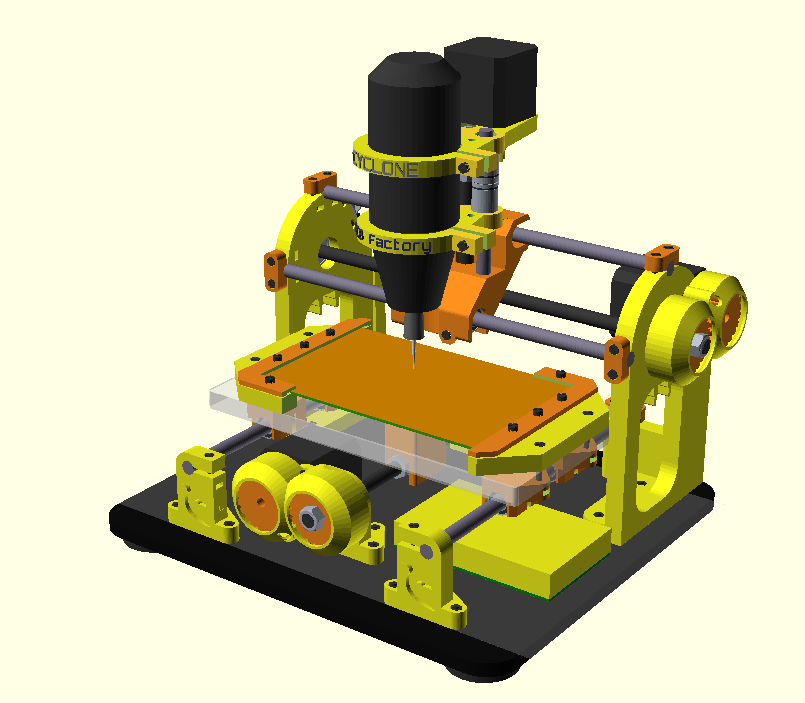

<i>A 3D-printable (Rep-Rap alike) CNC machine, intended for PCB manufacture.</i>

  

Read this, it's important!
===========================
If you are reading this, then you are looking at the **development version** of Cyclone PCB Factory.
This means files may present inconsistencies (dimensions mismatch, lack of tolerances, etc).
**If you just want to build the machine, take a look at the following locations:**

- **Releases: <https://github.com/carlosgs/Cyclone-PCB-Factory/releases>**
- **Documentation: <http://reprap.org/wiki/Cyclone_PCB_Factory>**

<i>Cyclone v2.0</i>

Mail list / Forum  
-------------------
If you are interested in this project, please consider joining our mail list:  
**<https://groups.google.com/forum/#!forum/cyclone-pcb-factory>**  
Any help and feedback will be appreciated, particularly with software usage and software development :)  

Links of interest  
====================
- **[Project network](https://github.com/carlosgs/Cyclone-PCB-Factory/network)** (useful to find the latest work by collaborators)
- **[Wiki entry on RepRap.org](http://reprap.org/wiki/Cyclone_PCB_Factory)**
- **[A year of development (01/20/2014)](http://carlosgs.es/node/47)** (with information regarding the evolution of the project in 2013)

Getting the (development) source files  
========================================
Install git (http://git-scm.com/) onto your system. Then run a clone:

	git clone git://github.com/carlosgs/Cyclone-PCB-Factory.git

This will download the latest sources into a directory named 'Cyclone-PCB-Factory'.  

Version 2.1 (Unstable, Work In Progress)  
--  

**Cyclone PCB Factory V2.0 was developed in the department of innovation and robotics at [bq](http://www.bq.com/)**  

V2.0 addresses all the issues from the original design, and implementing improvements by yOPERO, Martin Zabojnik and others.  

* More robust design with tougher parts:
 * Better holders for the linear bearings (vibration made them slide away)
 * Reinforced nut/screw holders
* Anti-backlash mechanisms
* Improved gears with smoother edges
* Protective cover for the gears
* Attachment for a vacuum cleaner
* Better scalability (parametrized design)
* Using a [Dremel 200](http://www.dremel.com/en-us/tools/Pages/ToolDetail.aspx?pid=200+Series) as the spindle motor
* Integrated endstop holders

Future improvements:  
--  
* Endstop integration for Z (integrated probe?)
* Re-implement/Improve the Z carriage, currently inherited from Cyclone V1

<i>Render of Cyclone v2.0</i>

  

<i>The new design tries to be more parametrized</i>

Videos  
--  
- v2.0 Plexiglass "Open Source Hardware" keychain: <http://www.youtube.com/watch?v=3Kftgog89wQ>
- v2.0 Cyclone Logo in PCB (October 2014): <http://www.youtube.com/watch?v=_6oWuco_N8U>
- v2.0a Plexiglass Cyclone logo (August 2014): <http://www.youtube.com/watch?v=lPQlIvBf7Ak>
- v2.0a Milling wax (August 2014): <http://www.youtube.com/watch?v=drV_r_OSsi4>
- v0.9.7 Cyclone PCB factory, the process (June 2013): <http://www.youtube.com/watch?v=fKW3fwy1h0k>
- v0.9.6 Y axis concept by Yopero <http://www.youtube.com/watch?v=XzcobonQP40>  
- v0.9.5 Probing a PCB <http://www.youtube.com/watch?v=m5zXL8k5T9E>  
- v0.9.5 Milling MDF <http://www.youtube.com/watch?v=2QpxjheEjEc> and <http://www.youtube.com/watch?v=zjav0hBtmYA>  
- v0.8 Drawing test: <http://www.youtube.com/watch?v=Y-HSdE89JOM>  
- v0.7.5 XY axis test: <http://www.youtube.com/watch?v=9umlq4oHG64>  
- v0.7.5 High speed XY test: <http://www.youtube.com/watch?v=H3uYCXryj60>  

Bill of materials (obsolete, to be updated and moved to the RepRap wiki page)  
--  
- Kobus' <https://docs.google.com/spreadsheet/ccc?key=0AjYcEd1WlkqCdERINEFvRk9mVTZvdXZFR0VHVjRWc2c#gid=0>  
- Robsbots' <https://docs.google.com/spreadsheet/ccc?key=0AmiiQRLnjs9cdE12VDFmTHJ4N3JoTzcwbkJPb0ZLSWc#gid=0>  
- Carlosgs' <https://docs.google.com/spreadsheet/ccc?key=0AsQp8IK25R4IdGk3LTdOWmpFR0Nrc0RhaVJaUC1CMUE> (consumables)  

More pictures  
--  

  

  

  

  

License  
--
License: **Attribution - Share Alike - Creative Commons (<http://creativecommons.org/licenses/by-sa/3.0/>)**  

Authors:  
--
**Carlos García Saura (<http://carlosgs.es>)** released the project as open-source and is the current maintainer.

**Many other people keeps contributing to the project (check GitHub contributions and "most active posters" at <https://groups.google.com/forum/#!aboutgroup/cyclone-pcb-factory>).**  

Special thanks  
--  
- **Arne Durr (D-Byte)** finished the OpenScad assembly and made the code much more parametric.  
- Plenty of feedback from **Pedro de Oro**, **Alberto Valero**, **Alberto Mendez** (and **Obijuan**, **Pacle**, **Jesus**, **Ana**, **Santi**, **Antonio**, **Jose**... :-P) at the _department of innovation and robotics at [bq](http://www.bq.com/)_. **Cyclone is much more user-friendly thanks to you!**  
- **Glen Chung** (<https://github.com/glenchung>) improved the OpenScad code quite a lot (a much more elegant code), providing a great start point for V2.0.  
- Z axis concepts by **Quim Borras** and the spindle motor holder by **Misan** were really useful!! Also, **Diego Viejo**'s machine was of great inspiration for the Z axis (<https://plus.google.com/u/0/photos/113930344830086538817/albums/5868944432651911713?authkey=CLDJgdehlN773gE>) **Thank you all!!**  
- This design woudn't have been possible without the encouragement of the **Panda CNC community** (<https://plus.google.com/u/0/communities/102402711800402614517>)  
- Also, thanks to **Juan González-Gómez (Obijuan <http://iearobotics.com>)** for naming the machine Cyclone :)  

Derived from / we have used / inspirational  
--
- "Linear actuator concept for CNC machines" by **Carlosgs** (<http://www.thingiverse.com/thing:45103>)  
- "Obiscad library" by **Obijuan** (<https://github.com/Obijuan/obiscad>)  
- "Minimal footprint friction-fit LM8UU holder" by **thantik** (<http://www.thingiverse.com/thing:23041>)  
- "Spindle mount for ShapeOko" by **Misan** (<http://www.thingiverse.com/thing:26740>)  
- "Carro Z para Cyclone CNC mill intended for PCB" by **Quim** (<http://www.thingiverse.com/thing:80718>)  
- "Write.scad (and DXF fonts)" by **HarlanDMii** (<http://www.thingiverse.com/thing:16193>)  
- "PCB Machining Vise" by **Forgetful_Guy** (<http://www.thingiverse.com/thing:63578>)  

Credit for the ideas used  
--  
The origin of Cyclone took place while I (carlosgs) was inside the **Panda CNC** community (<https://plus.google.com/u/0/communities/102402711800402614517>). This is from December 2012 to mid-February 2013.  
Here is the credit for the ideas that were used:  

* _Let's design a 3D-printable CNC for PCB milling, it will be named Panda:_ **Guillermo Welch** (mid-December, via Google Talk)  
* _X carriage rod distribution:_ **César Augusto Fernández Cano** claims Cyclone's X axis is a derivate of his concept: <https://plus.google.com/u/0/111421387442355054591/posts/QrfYtEuZBaj>  
* _100x160mm workspace:_ **David Martin** <https://dl.dropboxusercontent.com/u/16122275/PandaCNC_credit/workplace_size.png>  
* _Using gears to drive the X-Y axes:_ **Guillermo Welch** <https://plus.google.com/u/0/101232926728463427403/posts/QjZGNcWcgGg>  
* _Regarding the woodbase:_ **Guillermo Welch** always contemplated the possibility of attaching the machine (optionally) to a woodbase. I decided to use the base as a main structural part instead. See <https://dl.dropboxusercontent.com/u/16122275/PandaCNC_credit/woodbase.png> (screenshot from <https://plus.google.com/u/0/113437723819360223498/posts/8LDCSSVWqCS>)  
* _List of CNC endmill types:_ **David Martin** <https://dl.dropboxusercontent.com/u/16122275/PandaCNC_credit/cnc_endmill_types.png>  

Please note I have taken screenshots of the post that are on the closed G+ Panda community (<https://plus.google.com/u/0/communities/116318709564872967169>). You can register and see by yourself.  

**All other development present on Cyclone has nothing to do with Panda and is not related to the Panda project.**  

Disclaimer  
--
This hardware/software is provided "as is", and you use the hardware/software at your own risk. Under no circumstances shall any author be liable for direct, indirect, special, incidental, or consequential damages resulting from the use, misuse, or inability to use this hardware/software, even if the authors have been advised of the possibility of such damages.  

