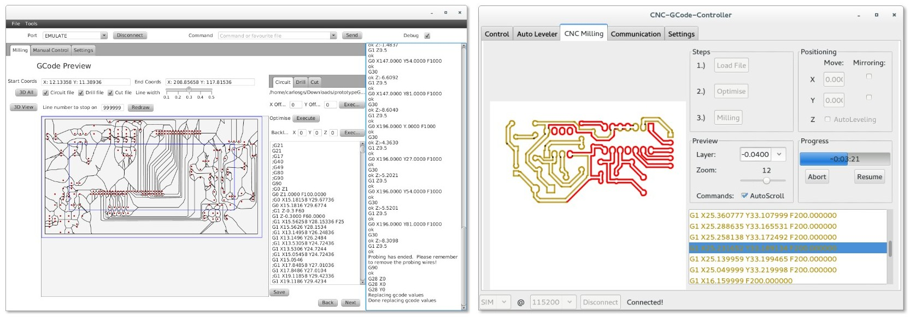
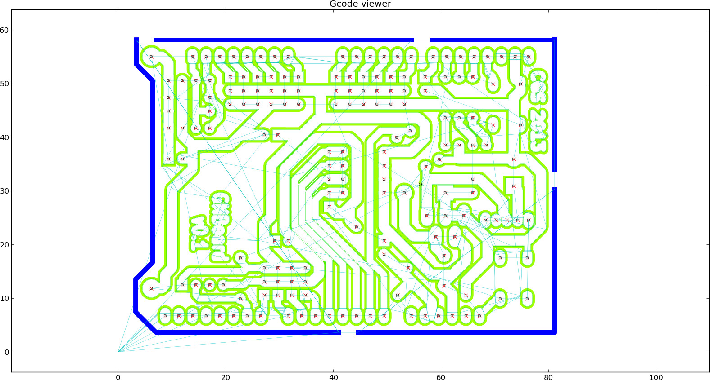

Software for Cyclone-PCB-Factory  
===================

**Read <https://github.com/carlosgs/grblForCyclone/wiki> for information regarding the software toolchain.**  

* [Kobus's GUI](https://www.dropbox.com/sh/k7p896n0upv29u1/1T_lcIZDnH/prototypeGui2) ([forum](https://groups.google.com/forum/#!msg/cyclone-pcb-factory/S3m1baPzwRk/DtyngGGJmBoJ)) and [Patrick Knöbel's gcode postprocessor](https://github.com/pknoe3lh/cncgcodecontroller/releases) ([forum](https://groups.google.com/forum/#!msg/cyclone-pcb-factory/ToTGIpXWUmA/gyQMDqDOXfUJ)):

**A modification of CNC-Gcode-Controller (pre-configured with Cyclone v2.0 parameters) can be downloaded from** <https://github.com/carlosgs/cncgcodecontroller/blob/master/CNC-GCode-Controller_libs.jar?raw=true>  

* [Python scripts by Carlosgs (obsolete)](PythonScripts/):

Disclaimer  
--
This hardware/software is provided "as is", and you use the hardware/software at your own risk. Under nocircumstances shall any author be liable for direct, indirect, special, incidental, or consequential damages resulting from the use, misuse, or inability to use this hardware/software, even if the authors have been advised of the possibility of such damages.  

